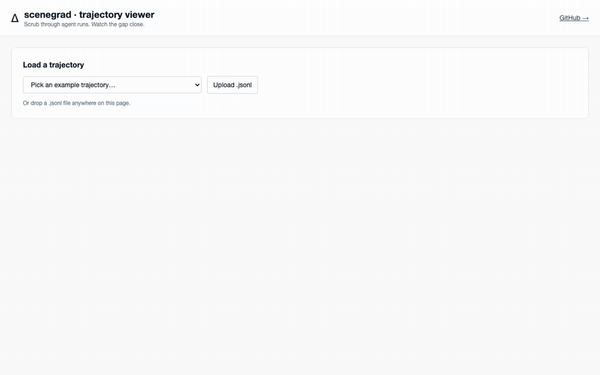

# scenegrad

> **Drop into your agent in 2 lines. Get a scrubbable replay. Level up when you're ready.**



*Above: a support-ticket triage agent built with Vercel AI SDK + Haiku, scrubbed through 5 steps. Watch the SCENE pane: the ticket starts as `status: new` and morphs as the agent works — `enriched` fields appear after the account lookup, `kb_match` after the KB search, `status: escalated-vip` and the full reply after the routing decision. Green-highlighted rows are the fields that just changed. The agent correctly escalated an enterprise customer's critical issue to VIP — never auto-resolved it (a weight-5 cardinal-sin assertion).*

scenegrad is a tiny observability + evaluation substrate for AI agents. Pay only for what you use:

```ts
import { trace } from "scenegrad";

const t = trace.start();

// your existing Vercel AI SDK / LangChain / custom loop, untouched:
const result = await generateText({
  model: anthropic("claude-haiku-4-5"),
  tools: { /* your tools, unchanged */ },
  onStepFinish: t.captureStep,         // ← only addition
  prompt: "...",
});

t.dump("./traces/run.jsonl");
```

That's it. Drop in, run, scrub the trace in the [viewer](./viewer). No goal to design. No assertions to write. No restructuring of your agent.

When you want more — add a `snapshot()` to capture world state between calls. Add a `goal()` of assertions to measure gap closure. Each level is opt-in.

---

## The four-tier ladder

| Tier | What you write | What you get |
|---|---|---|
| **0 — trace** | `trace.start()` + one hook | Tool-call timeline, scrubbable. Replaces logs. |
| **1 — + snapshot** | Add `snapshot: () => fetchWorld()` | World deltas between calls. See *what changed*, not just what was called. |
| **2 — + goal** | Add `goal: (s) => [...assertions]` | Gap-closure curve, drift detection, runtime `status()` for agent guidance. |
| **3 — + solver** | Use `defineEnv` + `LLMSolver` / `GreedySolver` | scenegrad drives the loop — for benches, comparison, leaderboards. |

The same trajectory format flows through all four tiers. You can adopt at tier 0, level up months later as you understand your agent's failure modes.

---

## Tier 1 — add a snapshot

When tools mutate external state (DBs, APIs, CRMs, queues), seeing what *changed* is more useful than seeing what was *called*. Pass a `snapshot` function:

```ts
const t = trace.start({
  snapshot: async () => ({
    user:        await db.users.findOne({ session_id }),
    welcome_sent: await emails.exists({ template: "welcome" }),
  }),
});
```

Now each step in the trajectory captures both `scene_before` and `scene_after`. The viewer can render the world delta per step.

---

## Tier 2 — add a goal, get drift detection + status()

Define what "done" looks like as assertions:

```ts
const watcher = observe({
  snapshot: async () => fetchWorld(),
  goal: (s) => [
    { name: "name_collected",   check: (s) => ({ satisfied: !!s.user?.name,        gap: 1 }) },
    { name: "email_collected",  check: (s) => ({ satisfied: !!s.user?.email,       gap: 1 }) },
    { name: "role_specified",   check: (s) => ({ satisfied: !!s.user?.role,        gap: 1 }) },
    { name: "welcome_email_sent", check: (s) => ({ satisfied: s.welcome_sent,       gap: 1 }) },
  ],
});

// In your existing loop, each turn:
const status = await watcher.status();

const result = await generateText({
  model: anthropic("..."),
  system: `Onboarding. Still unmet: ${status.unmet.map(a => a.name).join(", ")}.`,
  tools: { /* unchanged */ },
  onStepFinish: async ({ toolCalls }) => {
    for (const c of toolCalls ?? [])
      await watcher.recordStep({ tool: { name: c.toolName, args: c.input } });
  },
});
```

The agent's checklist is now **grounded in actual world state — not its working memory.** When you evaluate post-hoc, you read the same assertions back through `watcher.trajectory()`. Spec written once; serves both runtime guidance and evaluation.

This is also TDD-shaped agent development: write the assertion → run → watch the gap → tighten. See `examples/inbox.ts` for the canonical three-iteration progression.

---

## Tier 3 — solver mode, for benches

When you want scenegrad to drive the loop (for benchmarks, comparison across models, controlled tests):

```ts
import { defineEnv, LLMSolver, GreedySolver } from "scenegrad";

const task = defineEnv({
  init:  () => ({ count: 0 }),
  goal:  (s) => [{ name: "count = 5",
                   check: s => ({ satisfied: s.count === 5, gap: 5 - s.count }) }],
  tools: () => [{ name: "inc" }, { name: "dec" }],
  step:  (s, t) => t.name === "inc" ? { count: s.count + 1 } : { count: s.count - 1 },
});

await new GreedySolver().solve(task, "default");           // baseline
await new LLMSolver({ model: "claude-haiku-4-5" }).solve(task, "default");  // LLM-driven
```

Both solvers produce the same `SolveResult` shape. Compare them on the same env to see how much the LLM drifts from the optimal greedy baseline.

---

## Why this isn't another agent framework

If you already use… | scenegrad adds…
---|---
LangChain / LangGraph | Drift measurement and per-task evaluation. LangChain orchestrates; scenegrad measures.
OpenTelemetry / Phoenix | A vocabulary for *what* to observe (scene + goal + diff), not just *how* to ship spans.
Custom eval scripts | A common shape so your evals are comparable across runs, models, teams.
System prompts to constrain behavior | A way to say "done" the framework can VERIFY, not just hope the LLM honors.

scenegrad doesn't replace your agent. It instruments your task so behavior becomes visible, comparable, and refinable.

---

## What scenegrad does NOT do

- **Doesn't write your distance function.** Domain-specific. Sometimes hard.
- **Doesn't induce your toolkit.** You author it; [autocompile](https://github.com/mirkokiefer/autocompile) refines it over time.
- **Doesn't solve local-optima / dead-end paths.** It exposes them; your solver picks the search strategy.
- **Doesn't replace your agent.** Your agent runs whatever loop it runs; scenegrad measures it.
- **Doesn't unify cross-domain distance.** ARC's "12 cells off" and SAP's "3 audit controls violated" aren't directly comparable — each domain owns its units.
- **Doesn't force the agent to predict gradients.** The natural drift signals (gap-not-closing, goal-claimed-but-unmet, vs-baseline) work without polluting the prompt.

---

## The thinking framework

We sense the scene / world now. We make assertions on it — sensor values, query responses, photos, descriptions. **It's always an *image of* the scene, not the scene itself.**

We have a future scene vaguely in mind. We assert that as best we can. The diff between now and then is the gradient. Tools are actions that close it. We make progress, re-evaluate, sometimes redefine the goal as we learn. Reality is complex; the loop is simple.

Two gradients flow through this: **the agent's** (closing scene-now to scene-then per step) and **yours** (closing the spec to reality, by tightening assertions when behavior surprises you). Both are gradient descent. Both happen in the same framework.

---

## Install + run the examples

```bash
npm install scenegrad
# optional, for LLMSolver:
npm install @anthropic-ai/sdk
# optional, for tier-0 with Vercel AI SDK:
npm install ai @ai-sdk/anthropic zod

# tier 0 — drop-in trace, no goal
ANTHROPIC_API_KEY=... bun examples/trace-only-aisdk.ts

# tier 2 — observer mode with goal + status injection
ANTHROPIC_API_KEY=... bun examples/onboarding.ts                  # Anthropic SDK
ANTHROPIC_API_KEY=... bun examples/support-triage-aisdk.ts        # Vercel AI SDK

# tier 3 — solver mode (for benches)
bun examples/counter.ts                                            # no LLM
ANTHROPIC_API_KEY=... bun examples/inbox.ts                        # LLMSolver, TDD progression
```

## Status

v0.0.1 — substrate types, `defineEnv`, `observe` (tiers 0/1/2), `trace.start()` (tier-0 alias), `GreedySolver`, `LLMSolver`, JSONL trace format, viewer scaffold.

Reference benches live in [scenebench](https://github.com/daslabhq/scenebench): ARC-trajectory ships first; AutomationBench (806 real tasks); S4Bench (SAP) and LeRobot (robotics) follow.

## Related

- [`scene-otel`](https://github.com/daslabhq/scene-otel) — wire format scenegrad emits trajectories in
- [`scenecast`](https://github.com/daslabhq/scenecast) — typed scene shapes + multi-size widgets that render trajectories visually
- [`scenebench`](https://github.com/daslabhq/scenebench) — benchmarks built on scenegrad
- [`autocompile`](https://github.com/mirkokiefer/autocompile) — observes accumulated trajectories, hardens patterns to code

## License

MIT.
